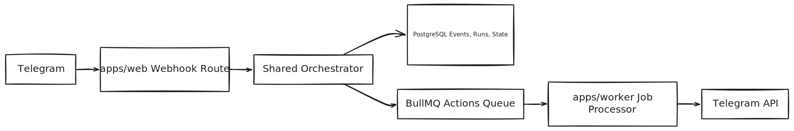

<picture>
  <source media="(prefers-color-scheme: dark)" srcset="docs/assets/logo-dark.svg">
  <source media="(prefers-color-scheme: light)" srcset="docs/assets/logo-light.svg">
  
</picture>

# Telegraph

**Build and run Telegram bot automations with a visual flow builder.**

[Website](https://telegraph.us.com) · [Cloud](https://telegraph.us.com/dashboard) · [Telegram](https://t.me/jointelegraph) · [Contributing](CONTRIBUTING.md)

## What Is Telegraph?

Telegraph is a SaaS platform for building Telegram bot automations without hand-writing the execution layer yourself. It combines a visual builder, webhook ingestion, workflow orchestration, queued action processing, and operational safeguards into one system for shipping Telegram bots at scale.

## Features

- Visual flow builder for Telegram automations
- Trigger, condition, and action-driven workflow execution
- Shared orchestrator logic used by both the web app and worker
- BullMQ-backed action processing for reliable async execution
- Billing and plan-limit enforcement during orchestration
- Encrypted bot token storage with application-level security
- Event deduplication and action idempotency for safer replays

## Architecture

  

## Repository Layout

| Path | Responsibility |
| --- | --- |
| `apps/web` | Next.js dashboard, API routes, webhook entrypoint, and flow builder UI |
| `apps/worker` | BullMQ worker that consumes and executes queued actions |
| `packages/shared` | Core domain logic, orchestrator, Telegram client, validation, and queue contracts |
| `prisma` | PostgreSQL schema and migrations |
| `tests` | Vitest unit and integration tests |

See [CONTRIBUTING.md](CONTRIBUTING.md) for the full development workflow, worktree support, testing, and troubleshooting.
